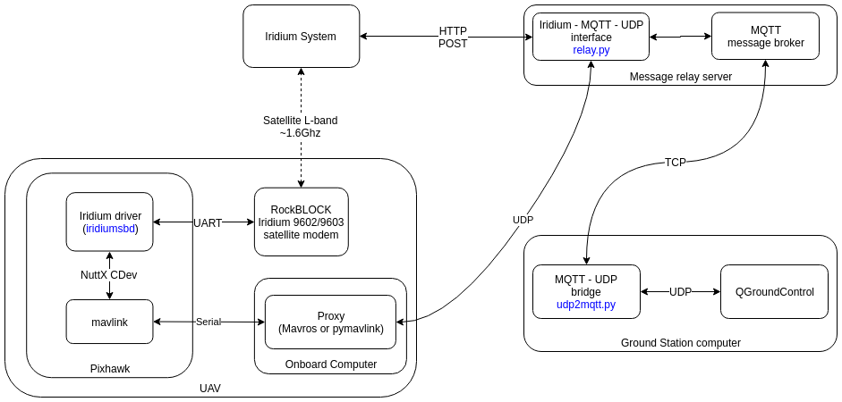
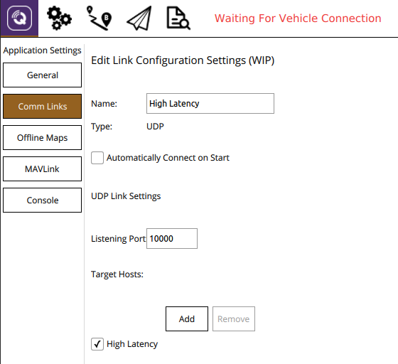

# Long Range Communication Systems
## Overview
The PX4 autopilot offers a pair of long range communication systems:

  * RockBlock Satellite Communication System (SatCom)
  * Wireless Broadband Communication System (WBCom)

In contrast to the [Telemetry Radios](telemetry/README.md) the two communication systems can offer unlimited range. Possible use cases of those systems are remote operation centers and/or BVLOS (Beyond Visual Line Of Sight) flights. It is recommended to run the two systems in parallel to get redundancy but also because the two systems complement each other. The satellite communication system is more reliable at higher altitudes because the likelyhood of a satellite being blocked by terrain decreases. Due to the design of the antennas of the broadband communication the signal quality usually deteriorates at higher altitudes.

The relay server and the ground station computer require the same setup steps and thus are treated in this chapter. For the vehicle and link specific setup, operating instructions, troubleshooting, and detailed link description please refer to the respective chapters:

* [SatCom](advanced_features/satcom_rockblock.md)
* [WBCom](advanced_features/wireless_broadband_com.md).

## System Architecture / Required Components

An system overview using both links can be found in the following figure:



> **Note** The setup was tested with the current release of *QGroundControl* running on Ubuntu 14.04, 16.04, and 18.04. 
  - It may be possible to run the system on other ground stations and operating systems, but this has not been tested and therefore is not guaranteed to work.

The following components are needed for both communication links:

* Pixhawk with the PX4 autopilot, ideally with a recent firmware version
* A message relay server with a fixed IP-address running Ubuntu Linux
* A ground station computer running *QGroundControl* on Ubuntu Linux

Components specific to the SatCom link:
* A [RockBlock 9603](http://www.rock7mobile.com/products-rockblock-9603) module connected to the Pixhawk
* A set up [user account](https://rockblock.rock7.com/Operations) on RockBlock with Credits available

Components specific to the WBCom link:
* A companion computer, for example an [Intel Up Squared](https://up-board.org/upsquared/specifications/)
* A working internet connection for the companion computer using for example an LTE stick with a valid sim card

## System Setup

The relay server and the ground station computer require the same setup steps and thus are treated in this chapter. For the vehicle and link specific setup please refer to the respective chapters:

* [SatCom](advanced_features/satcom_rockblock.md)
* [WBCom](advanced_features/wireless_broadband_com.md).

### Relay Server

The relay server should operate using Ubuntu and should have a static IP address and the following open ports:

* TCP:
	* `1883` for the Mosquitto message broker (could be configured)
	* `45679` for the HTTP POST interface (can be changed in `relay.cfg`)

* UDP for the WBCom:
    * `30000` for receiving messages (can be configured in `relay.cfg`)

* Install the required python modules

    `pip install tornado==5.1.1 future paho-mqtt`

* Install the `mosquitto` message broker

    `sudo apt-get install mosquitto`

* If you want to protect the MQTT connection with a password configure the [broker's credentials](https://www.vultr.com/docs/how-to-install-mosquitto-mqtt-broker-server-on-ubuntu-16-04):

    `sudo mosquitto_passwd -c /etc/mosquitto/passwd USER` -> `Password: PASSWORD`

    `sudo nano /etc/mosquitto/conf.d/default.conf` with

```
allow_anonymous false
password_file /etc/mosquitto/passwd
```

* Install tmux if you prefer tmux over screen:

    `sudo apt-get install tmux`

* Clone the SatComInfrastructure repository:

    `git clone https://github.com/acfloria/SatComInfrastructure.git`

* Edit the `relay.cfg` configuration file to reflect your settings.

* Add a `credentials.cfg` configuration file in the location as the `relay.cfg` file containing the user sensitive information. The file should have the following structure:

```
[mqtt]

# username and password for the mqtt broker (mosquitto)
user = MQTT_USER
password = MQTT_PASSWORD

[rockblock]

# IMEI of the destination RockBLOCK modem
imei = MODULE_IMEI

# Rock7 username
username = ROCK7_USERNAME

# Rock7 password
password = ROCK7_PASSWORD
```

* Start the relay script in the detached mode using screen or [tmux](https://linuxize.com/post/getting-started-with-tmux/):
	
	`screen -dm bash -c 'cd SatcomInfrastructure/; ./relay.py`

* To check if the script did start up correctly you can attach to the session (`screen -dr` or `tmux attach`). If you see `Connected with result code 0` then the script did boot up correctly and the relay server is operational.

### Ground Station Computer

It is assumed that the ground station computer operating system is Ubuntu.

* Install the required python modules

    `pip install tornado==5.1.1 future paho-mqtt`

* Clone the SatComInfrastructure repository:

    `git clone https://github.com/acfloria/SatComInfrastructure.git`

* Edit the `udp2mqtt.cfg` configuration file to reflect your settings and also add the same `credentials.cfg` configuration file as you created on the relay server.

* [Install](https://docs.qgroundcontrol.com/en/getting_started/download_and_install.html) the latest dayly build of QGroundControl.

* Add a UDP connection in QGC with the parameters for the SatCom link:

    * `Listening port: 10000`
    * `Target hosts: 127.0.0.1:10001`
    * `High Latency: Checked`

* Add a UDP connection in QGC with the parameters for the LTE link:

    * `Listening port: 20000`
    * `Target hosts: 127.0.0.1:20001`
    * `High Latency: Not checked`



