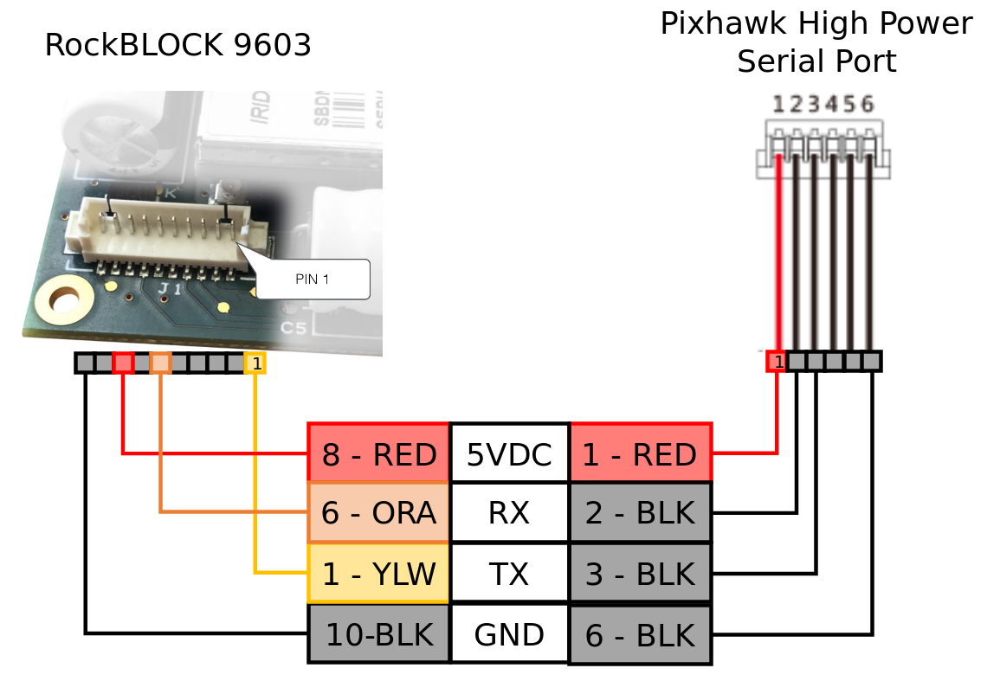

# Iridium/RockBlock Satellite Communication System

The satellite communication system (SatCom) can be used to provide long range high latency link between a ground station and a vehicle.

This topic describes how to set up and run a system that uses RockBlock as the service provider for the Iridium SBD Satellite Communication System. 
Given good signal quality, users can expect a median latency between 10 to 15 seconds. The latencies experienced while developing the framework are ranging from
5 seconds up to 180 seconds and were highly dependent on the flight location and environment conditions. Usually the connection was better in flight because the line of sight to the satellites was less likely to be blocked by terrain.

An unofficial status about the iridium system can be found [here](http://www.rod.sladen.org.uk/iridium.htm).

## Costs

The link running cost consists of a line rental and per message cost:
* Each module must be activated by paying a monthly line rental fee
* Each message transmitted over the system costs one *credit* per 50 bytes. Bundles of credits can be bought from RockBlock. The price per credit depends on the bundle size.

Refer to the [RockBlock Documentation](https://docs.rockblock.rock7.com/docs) for a detailed explanation of the modules, [running costs](https://docs.rockblock.rock7.com/docs/iridium-contract-costs) and *RockBlock* in general.

## Vehicle Setup

#### Wiring

Connect the RockBlock module to a serial port of the Pixhawk. 
Due to the power requirements of the module it can only be powered over a high-power serial port as a maximum of 0.5 A at 5 V are required. 
If none is available/free then another power source which has the same ground level as the Pixhawk and can provide required power has to be setup. 
The details of the [connectors](https://docs.rockblock.rock7.com/docs/connectors) and the [power requirements](https://docs.rockblock.rock7.com/docs/power-supply) can be found in the RockBlock documentation.



#### Module

The module can either use the internal antenna or an external one connected to the SMA connector. 
To [switch between the two antennas modes](https://docs.rockblock.rock7.com/docs/switching-rockblock-9603-antenna-mode) the position of a small RF link cable needs to changed. 
If an external antenna is used always make sure that the antenna is connected to the module before powering it up to avoid damage to the module.

The default baud rate of the module is 19200. However, the PX4 *iridiumsbd* driver requires a baud rate of 115200 so it needs to be changed using the [AT commands](http://www.rock7mobile.com/downloads/IRDM_ISU_ATCommandReferenceMAN0009_Rev2.0_ATCOMM_Oct2012.pdf).

1. Connect to the module with using a 19200/8-N-1 setting and check if the communication is working using the command: `AT`. 
   The response should be: `OK`.
2. Change the baud rate:
   ```
   AT+IPR=9
   ```
3. Reconnect to the model now with a 115200/8-N-1 setting and save the configuration using:
   ```
   AT&W0
   ```

The module is now ready to be used with PX4.

#### Software

[Configure the serial port](../peripherals/serial_configuration.md) on which the RockBlock module will run using [ISBD_CONFIG](../advanced_config/parameter_reference.md#ISBD_CONFIG).
There is no need to set the baud rate for the port, as this is configured by the driver.

> **Note** If the configuration parameter is not available in *QGroundControl* then you may need to [add the driver to the firmware](../peripherals/serial_configuration.md#parameter_not_in_firmware):
  ```
  drivers/telemetry/iridiumsbd
  ```

If you add the driver to a custom startup script please have a look at the [official startup command](https://github.com/PX4/Firmware/blob/master/src/drivers/telemetry/iridiumsbd/module.yaml) since it is important to give the driver time to power up (charge the capacity) and check if the driver did start correctly before starting the corresponding mavlink instance.

#### RockBlock Setup

When buying the first module on RockBlock an user account needs to be created in a first step.

Log in to the [account](https://rockblock.rock7.com/Operations) and register the RockBlock module under the `My RockBLOCKs`. 
Activate the line rental for the module and make sure that enough credits for the expected flight duration are available on the account.
When using the default settings one message per minute is sent from the vehicle to the ground station.

Set up a delivery group for the message relay server and add the module to that delivery group:


#### Relay Server and Ground Station Computer Setup
Please refer to the [Long Range Communication](../advanced_features/long_range_com.md) chapter.


## Setup Verification
It is assumed that the relay server is set up and operational according to the procedure explained in [Long Range Communication](../advanced_features/long_range_com.md) chapter.

#### Relay Server and Ground Station Computer Setup Verification

1. Open a terminal on the ground station computer and change to the location of the *SatComInfrastructure* repository. 
   Then start the **udp2mqtt.py** script:
   ```
   ./udp2mqtt.py
   ```
   If you see the following line:
     `Connected with result code 0`
   it means that the connection to the relay server was successful.

2. Send a test message from your [RockBlock Account](https://rockblock.rock7.com/Operations) to the created delivery group in the `Test Delivery Groups` tab.

   If in the terminal where the `udp2mqtt.py` script is running within a couple of seconds the acknowledge for a message can be observed:
     `MQTT received message from telem/SatCom_from_plane`
   Then the RockBlock delivery group, the relay server and the udp2rabbit script are set up correctly:


#### Full System Setup Verification
1. Start *QGroundControl* and connect only the high latency link.
2. Open a terminal on the ground station computer and change to the location of the *SatComInfrastructure* repository. 
   Then start the **udp2mqtt.py** script:
   ```
   ./udp2mqtt.py
   ```
3. Connect to the [system console](https://dev.px4.io/v1.9.0/en/debug/system_console.html) of the PX4 and then power up the drone and observe the output of the system console.
4. If one can observe
     ```
     INFO  [iridiumsbd] starting
     ```
   without any iridiumsb related warning it indicates that the driver did boot up properly.
5. If one can observe something similar to:
     ```
     INFO  [mavlink] mode: Iridium, data rate: 1200 B/s on /dev/iridium @ 115200B
     ```
   it also indicates that the mavlink instance did start correctly.
6. In the system console check the driver status using `iridiumsb status`. The system will send an initial message to initialize the link which can be seen in the status either by
     ```
     INFO  [iridiumsbd] TX session pending: 1
     ```
   which indicates the message is not sent yet or a nonzero
     ```
     Last Heartbeat XXXXXX
     ```
   which indicates the message was successfully sent to the Iridium system.
7. One could trace the message by checking the outputs in the [RockBlock user account](https://rockblock.rock7.com/Operations), on the relay server, and in terminal where the `./udp2mqtt.py` script is running. Once the message is received by *QGroundControl* it should indicate that the connection to a new vehicle was established. This verifies that all parts of the link are working.

## Descriptions and Limitations of the SatCom link
Due to the high latency and limited bandwidth of the SatCom link it does not support the same set of functionalities as a standard low latency link (e.g. radio telemetry). The philosophy, when designing the SatCom link, was to limit the amount of messages transmitted from the vehicle to the ground control station. The [HIGH_LATENCY2](https://mavlink.io/en/messages/common.html#HIGH_LATENCY2) was specifically designed for this link. It packes the most important information in one message and has a size of exactly 50 bytes when using MAVLink V1. QGC treats the `HIGH_LATENCY2` message as a heartbeat and will initiate the link once a single `HIGH_LATENCY2` message is received. The `HIGH_LATENCY2` message has some custom fields which a developer could use to fill in application/vehicle specific information.

During normal operation, if the SatCom link is the active priority link, from the vehicle only a regular `HIGH_LATENCY2` message is sent (by default every 60 s) and the acknowledgments for received commands. QGC does not send any regular messages to the vehicle (heartbeats are disabled) and only supports sending specific commands. In case the vehicle is not flying, specifically not armed, no messages are sent from the vehicle to QGC. This decision was made to limit the number of transmitted messages from the vehicle. On the ground it is anyway recommended to use a low latency link to setup/observe the vehicle status, since the SatCom link only provides sparse status update at a low frequency.

Given the high latency nature of the SatCom link QGC and PX4 use larger values for the timeouts. The communication timeout on the vehicle side is set to a default value of 120 s ([COM_HLDL_LOSS_T](../advanced_config/parameter_reference.md#COM_HLDL_LOSS_T)) instead of 10s ([COM_DL_LOSS_T](../advanced_config/parameter_reference.md#COM_DL_LOSS_T)) of a low latency link. Since no regular messages are received from on the vehicle from the ground station successfully sending a message is used as a heartbeat. This means that every time a message is successfully sent to the Iridium system the communication lost timer is reset.

On the QGC side for the communication link the timeouts are disabled meaning once initialized the link can be used until disconnected. The [command protocol](https://mavlink.io/en/services/command.html) of MAVLink demands to resend a command, if no acknowledgment from the vehicle is received within a certain time, to guarantee the delivery of the message. This time period is increased from 3 s to 120 s if the command is sent using the SatCom link. QGC always sends the command only using one communication link even if multiple links are connected. This link is the so called priority link and is shown in the toolbar with the *LinkIndicator* in case multiple links are connected to the vehicle. The priority link is determined the following ways:
   * If no link is commanded by the user an active regular low latency telemetry link is always preferred over the high latency link.
   * The autopilot and QGC will fall back from the regular low latency telemetry to the high latency link if the vehicle is armed and the low latency telemetry link is lost (no MAVLink heartbeat received for a certain time). If high latency link is activated that way as soon as the low latency telemetry link is regained QGC and the autopilot will switch back to low latency link.
   * The user can select any available communication link as the priority link over the `LinkIndicator` on the toolbar. This link is then kept as the priority link as long as this specific link is active or the user selects another priority link using the `LinkIndicator`. The command to switch to a certain communication link is sent over that specific communication link to make sure that this new link is able to transmit messages.

     

Certain MAVLink protocols are disabled when using the SatCom link. For example the [mission protocol](https://mavlink.io/en/services/mission.html) as well as the [parameter protocol](https://mavlink.io/en/services/parameter.html) are disabled as they would require too many messages sent over the communication link. This implies that using the SatCom link no mission can be downloaded, modified, or uploaded and no parameter values can be observed or changed. The virtual joystick of QGC is also disabled in case the priority link is a high latency link. The only communication allowed from QGC to the vehicle is sending simple commands such as:
* Changing flight modes (for example return to home or flight termination)
* Changing the current tracked waypoint (this can be only done if the current mission is present on QGC)
* Sending a GoTo command

PX4 executes the commands in order they are received on the vehicle. Normally when operating only one link this is not an issue, but if two links with significantly different latencies (e.g. radio telemetry and SatCom) are used the order could be mixed up while transmitting the messages over the different links. One such scenario is that if low latency telemtry is lost and the user sends a command (e.g. change to RTL) using the high latency link. Shortly after sending that command the low latency telemetry is regained and the user sends a command to switch the vehicle back to mission mode. If the command over the high latency link was not yet received by the vehicle the new command has no effect and once the RTL command is received by the vehicle, it actually would switch the flight mode. Given that there is at the moment no software solution in place, to detect and solve that issue the operator has to be aware of this limitation and take it into consideration when operating with a high latency communication link.

The relay server latches the last incomming message from the plane to make sure they are transmitted ground stations that connect to the relay server shortly after the message is received on the server. The queue will be reset after a certain time without a new message to avoid transmitting too old messages. The timeout period can be set in the `relay.cfg` file.

The current implementation of the relay server only supports a single active vehicle at any time. Connecting multiple vehicles over a SatCom link at the same time would either require multiple relay servers, one for each vehicle, or upgrading the software of the relay server to support multiple vehicle on one server.

## Running the System
This specific startup order makes sure that the initial message, which is used to initialize the link in QGC, is not missed. Any other order might still work but there is a small risk that the message might be missed (for example `./udp2mqtt.py` just forwards the message but does not check if it is received by QGC, so if QGC was not open the message is lost).

1. Start *QGroundControl*. Manually connect the high latency link first, then the regular telemetry link:

   

2. Open a terminal on the ground station computer and change to the location of the *SatComInfrastructure* repository. 
   Then start the **udp2mqtt.py** script:
   ```
   ./udp2mqtt.py
   ```
3. Power up the vehicle.

4. Wait until the first `HIGH_LATENCY2` message is received on QGC.
   This can be checked either using the *MAVLink Inspector* widget or on the toolbar with the *LinkIndicator*. 
   If more than one link is connected to the active vehicle the *LinkIndicator* shows all of them by clicking on the name of the shown link:

   

   The link indicator always shows the name of the priority link. Messages can be received over any link but commands are only sent from QGC to the vehicle through the priority link.

5. The satellite communication system is now ready to use. Unless commanded it will be only used if no other communication link is available.

## Troubleshooting

* Satellite communication messages from the airplane are received but no commands can be transmitted (the vehicle does not react)
  * Check the settings of the relay server and make sure that they are correct, especially the IMEI.
* No satellite communication messages from the airplane arrive on the ground station:
  * Check using the system console if the *iridiumsbd* driver started and if it did that a signal from any satellite is received by the module:
    ```
    iridiumsbd status
    ```
  * Make sure using the verification steps from above that the relay server, the delivery group and the `udp2rabbit.py` script are set up correctly.
  * Check if the link is connected and that its settings are correct.
  
* The IridiumSBD driver does not start:
  * Reboot the vehicle. 
    If that helps increase the sleep time in the `extras.txt` before the driver is started. 
    If that does not help make sure that the Pixhawk and the module have the same ground level. Confirm also that the baudrate of the module is set to 115200.

* The iridium mavlink instance does not start properly
  * Check the firmware version. Between v1.8 and v1.11 a bug in the mavlink module that caused the crash of the module on start up.

* A first message is received on the ground but as soon as the vehicle is flying no message can be transmitted or the latency is significantly larger (in the order of minutes)
  * Check the signal quality after the flight. 
    If it is decreasing during the flight and you are using the internal antenna consider using an external antenna. 
    If you are already using the external antenna try moving the antenna as far away as possible from any electronics or anything which might disturb the signal.
    Also make sure that the antenna is is not damaged.

* The first message is not transmitted although the pipeline was working earlier
  * Check if there is any satellite visible at the moment from your current location. [Satflare](http://www.satflare.com/track.asp?q=Iridium#MAP) offers on their webpage a tool to visualize the satellites visible on a given location on the earth. Just set your current location using the `Set your Location` button and check if the currently visible satellite is behind the terrain.


